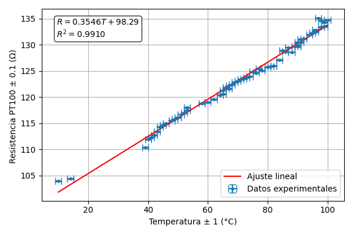
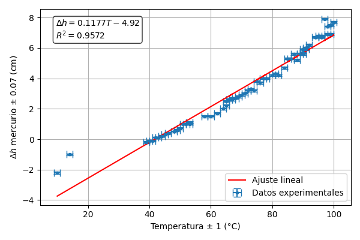
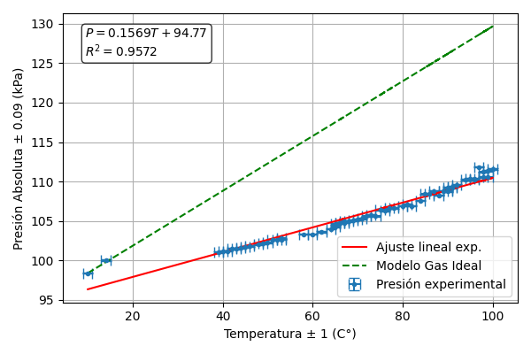

# Temperature Sensor Calibration: PT100 and Gas Manometer

Experimental calibration of two temperature-dependent systems: a **PT100 resistance temperature detector** and an **air-filled bulb connected to a mercury U-tube manometer**.

The experiment was carried out for *Fundamentos de Termodinámica Aplicada (ICF 130)* at Universidad Técnica Federico Santa María. A thermocouple was used as the temperature reference while the PT100 resistance and mercury-column levels were recorded over a broad temperature range.

**Final report:** [Calibración de sensores de temperatura mediante PT100 y sistema manométrico de gas](../../papers/calibracion-de-sensores-de-temperatura.pdf)

## Objectives

- Calibrate a PT100 by determining the relationship between electrical resistance and temperature.
- Determine the PT100 temperature coefficient from the experimental linear fit.
- Measure the pressure change of confined air using a mercury manometer.
- Compare the experimental pressure-temperature relationship with the prediction of an ideal gas under an isochoric assumption.
- Quantify measurement uncertainties and propagate them to derived quantities.

## Experimental method

Two measurements were performed in parallel:

1. **PT100 calibration** — the PT100 and reference thermocouple were immersed in thermal baths while the sensor resistance was measured with a multimeter.
2. **Gas manometer** — an air-filled bulb was connected to a mercury U-tube. The bulb was immersed in the thermal bath while the heights of both mercury columns were measured.

The gas pressure was obtained from the hydrostatic relation

$$
P_{gas}=P_{atm}+\rho g\Delta h,
$$

where

$$
\Delta h=h_{right}-h_{left}.
$$

For the PT100, the response was modeled as

$$
R(T)=R_0[1+\alpha(T-T_0)].
$$

## Data analysis

The complete analysis was implemented in Python using **NumPy**, **SciPy** and **Matplotlib**. The script:

- calculates $\Delta h$ and absolute gas pressure;
- propagates instrumental uncertainty from both mercury-height measurements;
- performs independent linear regressions for $R(T)$, $\Delta h(T)$ and $P(T)$;
- estimates the PT100 temperature coefficient $\alpha$;
- generates plots with experimental uncertainty bars;
- compares the experimental $P(T)$ trend with an ideal-gas isochoric prediction.

The reproducible analysis is available in [`src/analysis.py`](./src/analysis.py), and the processed measurements are stored in [`data/experimental_data.csv`](./data/experimental_data.csv).

## Results

### PT100 resistance vs temperature

$$
R(T)=(0.3546\pm0.0043)T+(98.2905\pm0.3192)\ \Omega
$$

$$
R^2=0.99095
$$

The corresponding temperature coefficient was

$$
\alpha=(3.61\pm0.05)\times10^{-3}\ ^\circ\mathrm{C}^{-1}.
$$



### Mercury height difference vs temperature

$$
\Delta h(T)=(0.1177\pm0.0032)T-(4.9160\pm0.2343)\ \mathrm{cm}
$$

$$
R^2=0.95724
$$

The propagated uncertainty in the height difference was

$$
\sigma_{\Delta h}=0.0707\ \mathrm{cm}.
$$



### Absolute gas pressure vs temperature

$$
P(T)=(0.1569\pm0.0042)T+(94.7687\pm0.3125)\ \mathrm{kPa}
$$

$$
R^2=0.95724
$$

The propagated pressure uncertainty was approximately

$$
\sigma_P=0.0943\ \mathrm{kPa}.
$$



The experimental pressure slope was lower than the ideal isochoric prediction. The report discusses three relevant experimental effects: the gas volume was not perfectly constant because the mercury was displaced, part of the gas occupied tubing outside the thermal bath (**dead volume**), and the mercury was not maintained at a uniform temperature throughout the experiment.

## Project structure

```text
calibracion-sensores-temperatura/
├── README.md
├── data/
│   └── experimental_data.csv
├── figures/
│   ├── mercury-height-vs-temperature.png
│   ├── pressure-vs-temperature.png
│   └── pt100-resistance-vs-temperature.png
├── src/
│   └── analysis.py
└── requirements.txt
```

The final academic report is stored in the repository-wide [`papers/`](../../papers/) directory.

## Reproducing the analysis

From this project directory:

```bash
pip install -r requirements.txt
python src/analysis.py
```

## Authors

**Paul Berdichewsky** · **Benjamín Arancibia**  
Universidad Técnica Federico Santa María — Santiago, Chile
